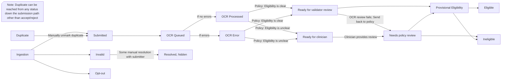

```mermaid
flowchart LR
    Note@{ shape: notch-rect, label: "Note: Duplicate can be reached from any status down the submission path other than accept/reject" }
    ing[Ingestion]
    sub[Submitted]
    ocrQ[OCR Queued]
    ocrE[OCR Error]
    ocrP[OCR Processed]
    rfr[Ready for validator review]
    rfc[Ready for clinician]
    npr[Needs policy review]
    acc[Eligible]
    rej[Ineligible]
    inv[Invalid]
    prov[Provisional Eligibility]
    resv[Resolved, hidden]
    opt[Opt-out]
    dup[Duplicate]

    
    ing-->sub
    ing-->opt
    ing-->inv

    dup-->|Manually unmark duplicate|sub

    sub-->ocrQ
    inv-->|Some manual resolution with submitter|resv

    ocrQ-->|If no errors|ocrP
    ocrQ-->|If errors|ocrE

    ocrP-->|Policy: Eligibility is clear|rfr
    ocrP-->|Policy: Eligibility is unclear|rfc
    ocrE-->|Policy: Eligibility is clear|rfr
    ocrE-->|Policy: Eligibility is unclear|rfc
    
    rfr-->|OCR review fails; Send back to policy|npr
    rfc-->|Clinician provides review|npr

    rfr-->prov
    npr-->prov
    npr-->rej

    prov-->acc
    prov-->rej
```